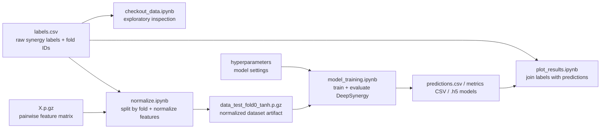

# DeepSynergy

This repository is a notebook-based working copy of a DeepSynergy workflow for drug-combination synergy modeling and result visualization. It is not a packaged Python project; the main assets are Jupyter notebooks that preprocess data, train a TensorFlow/Keras model, inspect label distributions, and plot prediction outputs.

The codebase currently contains notebook logic only. The datasets, generated intermediate files, and the `hyperparameters` file referenced by training are not committed in this repository, so the documentation below focuses on the architecture, data contracts, and execution flow needed to understand or reproduce the work.

## Documentation Map

- [Project Overview](docs/project-overview.md)
- [Architecture and Data Flow](docs/architecture.md)
- [Notebook Reference](docs/notebook-reference.md)
- [Reproducibility Guide](docs/reproducibility.md)

## Repository Snapshot

| Path | Role |
| --- | --- |
| `checkout_data.ipynb` | Exploratory analysis of label distributions and synergy heatmaps from the raw labels file. |
| `normalize.ipynb` | Builds fold-based train/validation/test splits and applies feature normalization. |
| `model_training.ipynb` | Loads normalized data, builds a Keras MLP, trains it, evaluates it, and saves prediction artifacts. |
| `plot_results.ipynb` | Combines saved predictions with label metadata to create KDE plots and prediction heatmaps. |
| `model_training.zip` | ZIP archive containing a notebook copy of the training workflow. |
| `plot_results.zip` | ZIP archive containing a notebook copy of the plotting workflow. |

## End-to-End Workflow

## Current State

- The notebooks use absolute paths under `/home/nidhi/Documents/freelancing/DeepSynergy/...`.
- The repository does not include:
  - raw input files such as `labels.csv` and `X.p.gz`
  - the generated normalized pickle file
  - the `hyperparameters` file
  - result CSVs written by the training notebook
- `.gitignore` excludes `hyperparameters` and Keras model files (`*.h5`).

## Reading Order

If you want to understand the project quickly, use this order:

1. [docs/project-overview.md](docs/project-overview.md)
2. [docs/architecture.md](docs/architecture.md)
3. [docs/notebook-reference.md](docs/notebook-reference.md)
4. [docs/reproducibility.md](docs/reproducibility.md)
