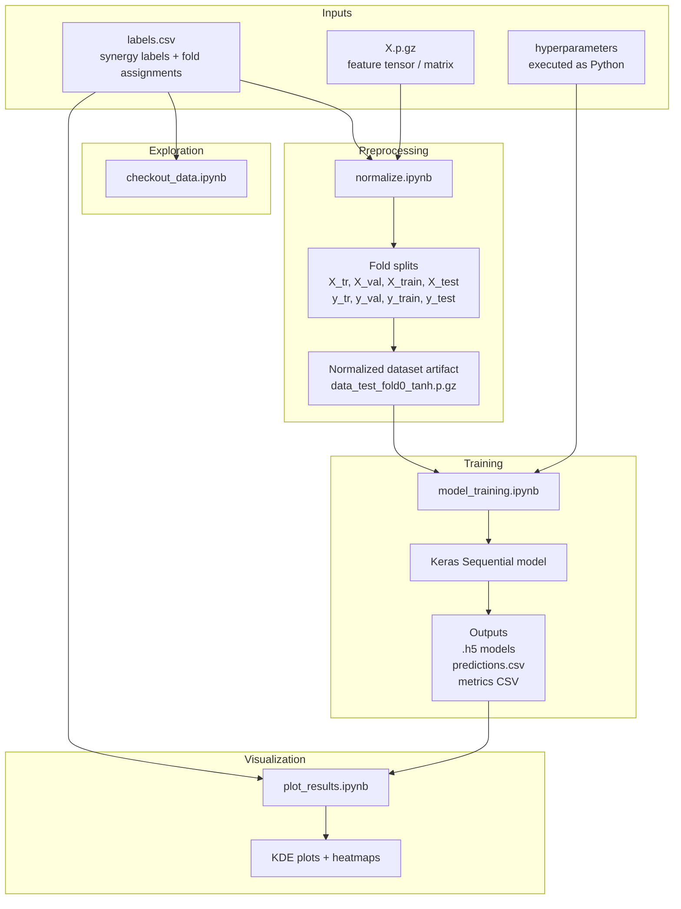
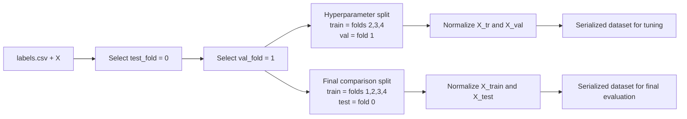
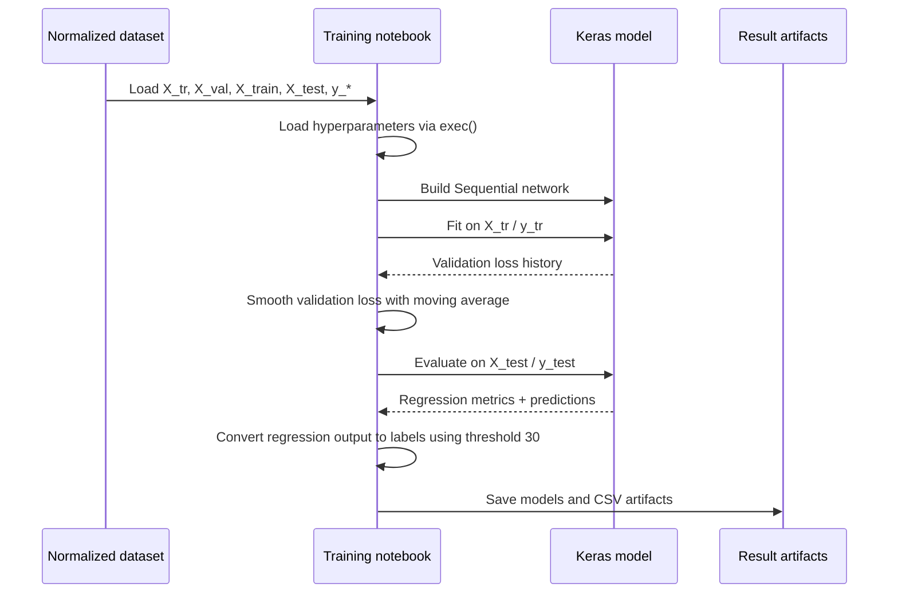

# Architecture and Data Flow

## System View

The project is best understood as a linear notebook pipeline with one exploratory branch. `normalize.ipynb` prepares data for modeling, `model_training.ipynb` trains and evaluates the neural network, and `plot_results.ipynb` turns saved predictions into visual diagnostics. `checkout_data.ipynb` is an earlier exploratory notebook that inspects the label distribution directly from raw labels.



## Processing Stages

### 1. Raw Label Inspection

`checkout_data.ipynb` groups the label dataset by `cell_line`, inspects synergy distributions with KDE plots, and builds heatmaps by deduplicating repeated `(drug_a_name, drug_b_name, cell_line)` combinations through a mean synergy aggregation.

This notebook does not train a model. Its role is exploratory:

- inspect label density
- inspect cell-line-specific variation
- inspect drug-pair heatmap structure

### 2. Fold-Based Preprocessing and Normalization

`normalize.ipynb` is the preprocessing stage. It:

1. Loads the gzipped feature matrix `X.p.gz`.
2. Loads `labels.csv`.
3. Defines a test fold and validation fold.
4. Builds two split schemes:
   - `X_tr` / `X_val` for hyperparameter selection
   - `X_train` / `X_test` for final comparison
5. Applies a custom normalization function.
6. Optionally serializes the result as a pickle artifact.

### Fold Logic

For the committed example:

- `test_fold = 0`
- `val_fold = 1`

That produces:

- training for hyperparameter selection: folds `2, 3, 4`
- validation for hyperparameter selection: fold `1`
- final training for methods comparison: folds `1, 2, 3, 4`
- held-out test set: fold `0`



### Normalization Strategy

The preprocessing notebook defines a custom `normalize(...)` function that:

- computes feature-wise standard deviation if not provided
- filters out zero-variance features
- standardizes features using training means and standard deviations
- optionally applies `tanh`
- under `tanh_norm`, applies a second mean/std normalization after the `tanh` transform

Supported modes in the function body are:

- `norm`
- `tanh`
- `tanh_norm`

The committed notebook sets:

- `norm = 'tanh'`

Even though the surrounding markdown explains `tanh_norm` behavior, the actual configured run in the notebook uses `tanh`.

### 3. Model Training and Evaluation

`model_training.ipynb` loads the preprocessed dataset and creates a `tf.keras.Sequential` feed-forward network. The exact shape is driven by a separate `hyperparameters` text file executed with:

```python
exec(open(hyperparameter_file).read())
```

The notebook expects the hyperparameter file to define at least:

- `layers`
- `act_func`
- `input_dropout`
- `dropout`
- `eta`

### Model Pattern

The model-construction logic follows this pattern:

- first layer:
  - `Dense(layers[0], input_shape=(X_tr.shape[1],), activation=act_func, kernel_initializer='he_normal')`
  - input dropout
- intermediate hidden layers:
  - `Dense(layers[i], activation=act_func, kernel_initializer='he_normal')`
  - dropout
- output layer:
  - linear `Dense`

Optimizer and metrics:

- optimizer: SGD with momentum `0.5`
- loss: mean squared error
- tracked metrics:
  - MSE
  - RMSE
  - MAE

### Training Modes

The notebook actually contains two related training flows:

1. A fixed-epoch training run over `X_tr` / `y_tr` with validation on `X_val` / `y_val`.
2. A second loop that reloads a saved model each epoch, trains on `X_train` / `y_train`, evaluates on `X_test` / `y_test`, and records metrics per epoch.

### Early-Stopping Analysis

The notebook does not use callback-driven early stopping. Instead, it computes a smoothed validation-loss curve manually with a moving average and inspects the minimum point afterward.



### 4. Prediction Visualization

`plot_results.ipynb` joins saved predictions back onto the label metadata and exposes two main visual views:

- KDE plot of the training-set synergy distribution for a selected cell line, with the model prediction drawn as a vertical line
- Heatmap of mean predicted synergy for a selected cell line across `(drug_a_name, drug_b_name)` pairs

This notebook depends on:

- `labels.csv`
- saved `predictions.csv`

It duplicates labels before joining predictions, reflecting the dual drug-order representation used elsewhere in the workflow.

## Evaluation Semantics

The project treats synergy prediction as a regression problem first, then derives classification metrics by thresholding both ground truth and predicted synergy:

- positive class: synergy `> 30`
- negative class: synergy `< 30`

The training notebook reports:

- regression metrics from Keras evaluation
- plain accuracy
- balanced accuracy

## Architectural Observations

The design is straightforward but tightly coupled:

- preprocessing, training, and plotting are separated conceptually
- file contracts are implicit rather than codified
- path configuration is hard-coded
- serialization format is ad hoc pickle plus CSV
- the hyperparameter file is dynamic code execution rather than declarative config

For documentation and maintenance purposes, the core architecture is therefore:

- data-in notebooks
- artifact handoff through files
- model-out notebooks
- visualization notebooks

instead of a reusable software package.
