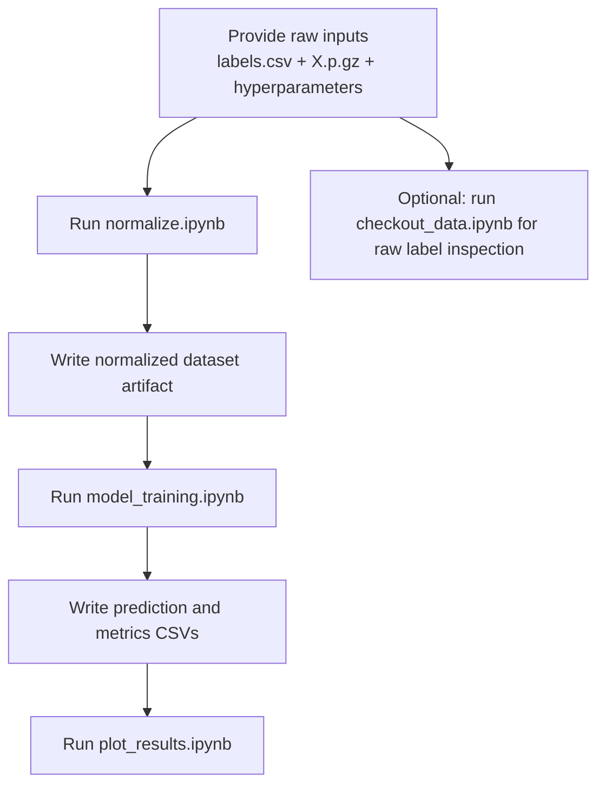

# Reproducibility Guide

## What You Need That Is Not In This Repository

The repository alone is not enough to execute the pipeline end to end. You need to supply:

- the raw label file `labels.csv`
- the gzipped feature matrix `X.p.gz`
- the `hyperparameters` file consumed by `model_training.ipynb`
- a writable results directory for generated CSVs and model files

## Recommended Local Layout

The notebooks expect paths under `/home/nidhi/Documents/freelancing/DeepSynergy/`. To reproduce the workflow cleanly, either:

1. recreate that directory structure locally, or
2. edit every hard-coded path in the notebooks before execution

A cleaner project-local structure would be:

```text
DeepSynergy/
├── data/
│   ├── labels.csv
│   ├── X.p.gz
│   ├── data_test_fold0_tanh.p.gz
│   └── Results/
│       ├── predictions.csv
│       ├── predictions_per_epoch_acc_50_epochs.csv
│       └── metrics_per_epoch_50epochs.csv
├── hyperparameters
├── checkout_data.ipynb
├── normalize.ipynb
├── model_training.ipynb
└── plot_results.ipynb
```

## Suggested Execution Order



## Practical Execution Notes

### 1. Inspect the Raw Labels

Run `checkout_data.ipynb` if you want to validate:

- available cell lines
- distribution of synergy values
- whether duplicate drug pairs exist for the same cell line

This step is informative but not required for training.

### 2. Generate the Normalized Split Artifact

Run `normalize.ipynb` next. Before doing that, confirm:

- the feature rows in `X.p.gz` align with the label rows in `labels.csv`
- the selected folds match the experiment you intend to reproduce
- the chosen normalization mode matches the artifact name you plan to use

If you want the output pickle to exist for the training notebook, you need to enable or recreate the commented save step.

### 3. Train and Evaluate the Model

Run `model_training.ipynb` after the normalized dataset exists and the `hyperparameters` file is available. Confirm that the hyperparameter file defines the variables the notebook expects:

- `layers`
- `act_func`
- `input_dropout`
- `dropout`
- `eta`

### 4. Plot Predictions

Run `plot_results.ipynb` after `predictions.csv` has been produced. Adjust:

- selected `drug_a`
- selected `drug_b`
- selected `cell_line`

to inspect other examples.

## Known Friction Points

### Hard-Coded Absolute Paths

Most file references point to a single user-specific directory tree. Path cleanup is the first step required to make the workflow portable.

### Hidden Configuration

The training architecture depends on a local `hyperparameters` file that is not documented in-repo. Without it, the model cannot be built.

### Manual Artifact Handoffs

The stages communicate through files, but those file contracts are informal. In practice, that means:

- output filenames must be kept consistent manually
- save steps may need to be uncommented
- consumers assume the producer has already run successfully

### Notebook-Centric Execution

Because the workflow is embedded in notebooks rather than Python modules:

- state can depend on execution order
- reruns can become inconsistent if cells are skipped
- auditing exact experiments is harder than in a script-based pipeline

## Recommended Next Cleanup Steps

If this repository is going to be maintained further, the highest-value improvements would be:

1. Replace absolute paths with project-relative paths.
2. Convert the `hyperparameters` file into a checked-in config format such as YAML or JSON.
3. Move preprocessing, training, and plotting logic into Python modules.
4. Add an environment file with pinned dependency versions.
5. Store generated artifacts under a repository-local `data/` or `artifacts/` directory.
